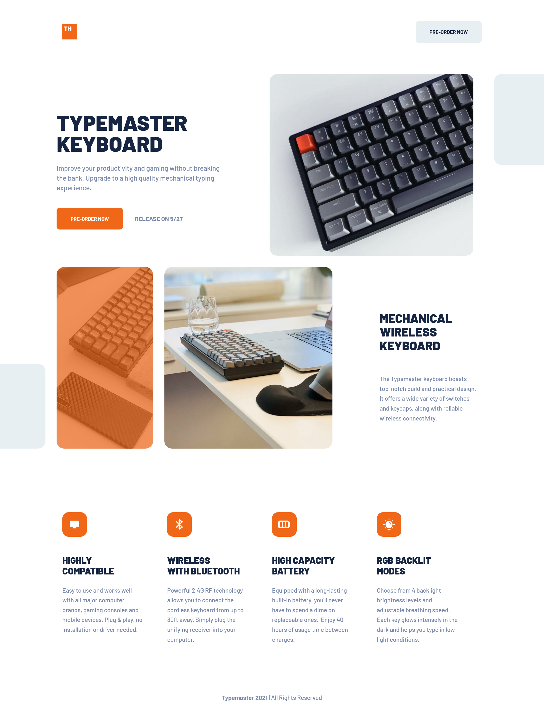

# Frontend Mentor - Typemaster pre-launch landing page solution

This is a solution to the [Typemaster pre-launch landing page challenge on Frontend Mentor](). Frontend Mentor challenges help you improve your coding skills by building realistic projects.

## Table of contents

- [Frontend Mentor - Typemaster pre-launch landing page solution](#frontend-mentor---typemaster-pre-launch-landing-page-solution)
  - [Table of contents](#table-of-contents)
  - [Overview](#overview)
    - [The challenge](#the-challenge)
    - [Screenshot](#screenshot)
    - [Links](#links)
  - [My process](#my-process)
    - [Built with](#built-with)
    - [What I learned](#what-i-learned)
    - [Continued development](#continued-development)
    - [Useful resources](#useful-resources)
  - [Author](#author)

## Overview

### The challenge

Users should be able to:

- View the optimal layout depending on their device's screen size
- See hover states for interactive elements

### Screenshot

### Links

- Solution URL: (https://github.com/Victoria-Sardelli/typemaster-prelaunch-landing)
- Live Site URL: (https://victoria-sardelli.github.io/typemaster-prelaunch-landing/)

## My process

### Built with

- Semantic HTML5 markup
- CSS custom properties
- Flexbox
- CSS Grid
- Mobile-first workflow

### What I learned

I learned a lot about CSS Grid, as this was my first time trying it out in a project. It was so cool to view my grids using Firefox devtools, and it was a fun challenge to mix flex and grid layouts to achieve this project's resposive designs.

I also learned that after and before pseudo-elements do not apply to replaced elements like img (source: https://css-tricks.com/7-practical-uses-for-the-before-and-after-pseudo-elements-in-css/). It took a while for me to get the orange overlay working on top of the phone-and-keyboard image, but I was able to do so by applying after styles to the containing div.

### Continued development

I would like to continue working on my CSS Grid skills, as well as furthering my understanding of semantic HTML and CSS best practices.

### Useful resources

- [CSS Grid by Wes Bos](https://youtube.com/playlist?list=PLu8EoSxDXHP5CIFvt9-ze3IngcdAc2xKG) - I watched this YouTube video series created by Wes Bos in order to learn the fundamentals of CSS Grid, and I really recommend it! Wes's explanations are clear and easy to follow, and the videos are split into small, manageable chunks.

## Author

- Frontend Mentor - [@Victoria-Sardelli](https://www.frontendmentor.io/profile/Victoria-Sardelli)